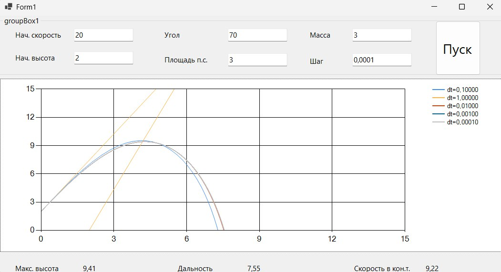

### Моделирование полёта тела в атмосфере

**Задание:**  
Реализовать приложение для моделирования полёта тела в атмосфере.  
Предусмотреть возможность ввода шага моделирования и вывода результатов.

| Шаг моделирования, с | 1 | 0.1 | 0.01 | 0.001 | 0.0001 |
|----------------------|---|-----|------|-------|--------|
| Дальность полёта, м |6.84|7.35|7.53|7.55|7.55|
| Максимальная высота, м |20.79|9.53|9.42|9.41|9.41|
| Скорость в конечной точке, м/с |28.12|9.37|9.23|9.23|9.22|

**Вывод:**
В результате моделирования полёта тела в атмосфере с различным шагом интегрирования dt установлено, что точность расчёта напрямую зависит от выбранного шага: уменьшение dt снижает накопленную погрешность метода. Однако при переходе от dt = 0.01 к dt = 0.001 и менее наблюдаемые изменения траектории становятся незначительными — графики практически сливаются. Это свидетельствует о том, что дальнейшее уменьшение шага не даёт существенного выигрыша в результате, но увеличивает время вычислений. Таким образом, для данной задачи рациональным компромиссом между точностью и производительностью является выбор шага моделирования в диапазоне 0.01–0.001.